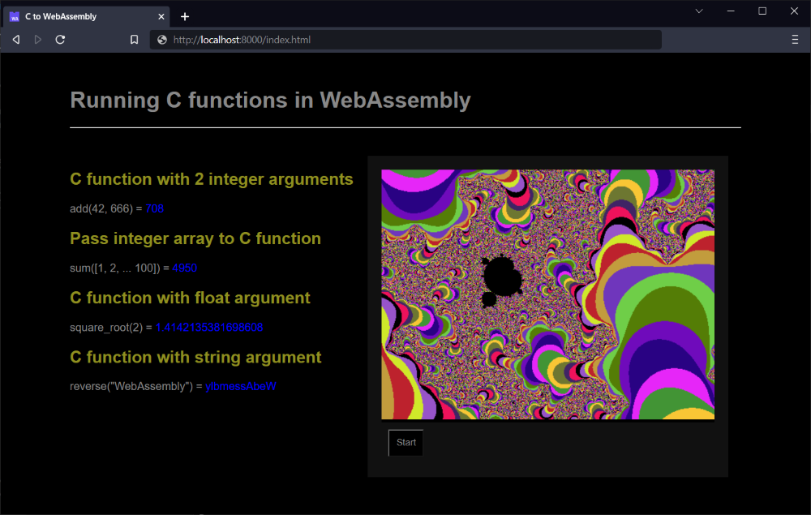

# Compile C to WebAssembly Experiment

## Dependencies

- LLVM - at least version 8
- WABT
- cmake - to build WABT, at least version 3.16

## Getting started

Tested on _Ubuntu 18.04.1 LTS_

Install dependencies, see below.

Clone this repo and build:

```console
$ git clone https://github.com/DeShrike/c-wasm.git
$ cd c-wasm
$ ./build.sh
```

Start a local webserver:

```console
$ python3 -m http.server 8000
```

Point your browser to http://localhost:8000/index.html



## Install LLVM

```console
$ sudo apt-get install llvm-8 clang-8 lld-8
```

## Build cmake

```console
$ mkdir ~/temp
$ cd ~/temp
$ wget https://cmake.org/files/v3.16/cmake-3.16.0.tar.gz
$ tar -xzvf cmake-3.16.0.tar.gz
$ cd cmake-3.16.0/
$ ./bootstrap
$ make -j$(nproc)
$ sudo make install
$ cmake --version
```

## Clone and build WABT

```console
$ git clone --recursive https://github.com/WebAssembly/wabt
$ cd wabt
$ git submodule update --init
$ mkdir build
$ cd build
$ cmake ..
$ cmake --build
$ sudo make install
```

## Usefull commands

```console
$ wasm-objdump -x main.o
```

```console
$ wasm2wat main.wasm
```
